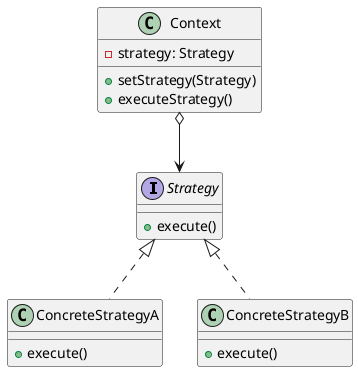
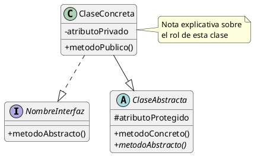
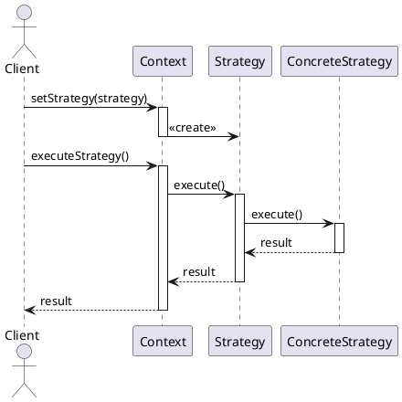

# 🎨 Diagramas UML

Esta carpeta contiene diagramas visuales de los patrones de diseño implementados en el repositorio.

---

## 📋 Tipos de Diagramas

### 🏗️ Diagramas de Clases
Muestran la estructura estática de clases, interfaces y sus relaciones:
- Herencia
- Implementación
- Composición
- Agregación
- Asociación
- Dependencias

### 🔄 Diagramas de Secuencia
Ilustran la interacción entre objetos en el tiempo:
- Flujo de mensajes
- Orden de ejecución
- Ciclo de vida de objetos
- Colaboración entre componentes

### 📦 Diagramas de Componentes
Representan la organización y dependencias de componentes:
- Módulos del sistema
- Interfaces provistas/requeridas
- Dependencias entre paquetes

### 🎭 Diagramas de Casos de Uso
Describen funcionalidad desde la perspectiva del usuario:
- Actores
- Casos de uso
- Relaciones (include, extend)

---

## 📁 Organización Sugerida

```
diagramas/
├── creacionales/
│   ├── singleton/
│   │   ├── singleton-class-diagram.png
│   │   ├── singleton-sequence.png
│   │   └── singleton-comparison.png
│   ├── factory-method/
│   ├── abstract-factory/
│   ├── builder/
│   └── prototype/
├── estructurales/
│   ├── adapter/
│   ├── bridge/
│   ├── composite/
│   ├── decorator/
│   ├── facade/
│   └── proxy/
├── comportamiento/
│   ├── strategy/
│   ├── observer/
│   ├── command/
│   ├── state/
│   ├── iterator/
│   └── template-method/
└── comparaciones/
    ├── patron-vs-sin-patron.png
    └── cuando-usar-que-patron.png
```

---

## 🛠️ Herramientas para Crear Diagramas

### PlantUML (Recomendado)
Diagramas como código - ideal para versionamiento.

**Ejemplo básico:**


**Instalación:**
```bash
# Extensión VS Code
code --install-extension jebbs.plantuml
```

### Draw.io
Editor visual gratuito y online.
- Web: https://app.diagrams.net/
- Integración con GitHub
- Exporta a PNG, SVG, PDF

### Lucidchart
Herramienta profesional (versión gratuita disponible).
- Colaboración en tiempo real
- Plantillas prediseñadas
- Integración con Google Drive

### StarUML
Software de modelado UML completo.
- Licencia gratuita para uso educativo
- Soporta todos los tipos de diagramas UML

---

## 📐 Convenciones y Estándares

### Notación UML 2.5
Seguir el estándar oficial UML:

**Relaciones:**
- **Herencia:** `─────▷` (línea con triángulo vacío)
- **Implementación:** `┄┄┄┄▷` (línea punteada con triángulo vacío)
- **Composición:** `◆────` (diamante relleno)
- **Agregación:** `◇────` (diamante vacío)
- **Asociación:** `─────` (línea simple)
- **Dependencia:** `┄┄┄┄>` (línea punteada con flecha)

**Visibilidad:**
- `+` público
- `-` privado
- `#` protegido
- `~` paquete

### Colores Sugeridos
- **Interfaces:** Azul claro
- **Clases abstractas:** Verde claro
- **Clases concretas:** Amarillo claro
- **Contexto:** Naranja claro
- **Cliente:** Gris claro

---

## ✅ Checklist para Cada Patrón

- [ ] Diagrama de clases básico
- [ ] Diagrama con ejemplo concreto
- [ ] Diagrama de secuencia (casos clave)
- [ ] Comparación: con vs sin patrón
- [ ] Variantes del patrón (si aplica)

---

## 📝 Plantillas

### Diagrama de Clases - PlantUML


### Diagrama de Secuencia - PlantUML


---

## 🎓 Recursos para Aprender UML

- **UML Distilled** - Martin Fowler
- **Learning UML 2.0** - Russ Miles, Kim Hamilton
- **Tutorial PlantUML:** https://plantuml.com/es/
- **UML Cheat Sheet:** https://loufranco.com/wp-content/uploads/2012/11/cheatsheet.pdf

---

## 🔗 Enlaces

- [Volver a Documentación](../README.md)
- [README Principal](../../README.md)

---

> **Tip:** Usa diagramas para complementar el código, no para reemplazarlo. Un buen diagrama comunica la estructura y relaciones de forma clara y concisa.
